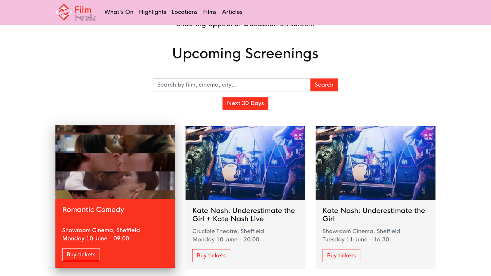

### An open source film screenings system, built with Python on Django.

Ostende has one principle objective - build reusable infrastucture for film exhibition.

Find an example at [filmfeels.co.uk](https://filmfeels.co.uk)

